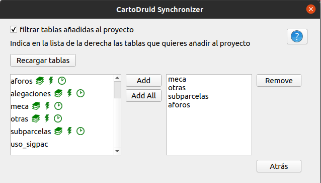

QGIS Plugin to synchronize SQLite databases to CartoDruid Synchronization services
============================

This project contains a QGIS plugin to sincronize the SQlite databases of your project using CartoDruid Synchronization
services.

CartoDruid is a free GIS Android tool that allows field technicians to capture information quickly without needing GIS
skills. The tool includes the most common functions of a GIS editor and manages both vector and raster information, but
focuses on making the data collection and integration of the tool as easy as possible in the organization's workflows.

CartoDruid handles vector data natively in SQLite with the Spatialite expansion, allowing cartography up to 2GB to be
handled with minimal latency. For raster data, CartoDruid supports MBTiles and Rasterlite files and also supports the
display of virtual layers based on images with EXIF metadata. These open formats give CartoDruid one of its greatest
strengths, offline work since it allows technicians to carry all the information necessary for their work on their
device and carry out tasks without the need for coverage.

To see a full list of features visit http://www.CartoDruid.es you can also ask us questions to consult us how to use
CartoDruid in your project in our forum https://foro.CartoDruid.es/.

## Using the plugin

When the plugin is installed a new menu will appear in the "Plugins" menu, with two options:

- Configure synchronization: lets you set up the local database that will receive the changes, endpoint of remote
  workspace and user credentials.
- Synchronize: runs the configured synchronization.

### Configuring your workspace accessing info

CartoDruid synchronization is an incremental sync process that updates the remote database applying local changes to get
a common view of data across all the clients of the workspace. To mark changed records in local database, the tables to
synchronize must have an 'updated_date' column (the column name is configurable) to detect the records that have been
modified since the last sync execution (those with `update_date is null or update_date >sinc_date`).

These columns `update_date` columns can be updated using a SQLite trigger, so when you modify your features from QGIS,
the corresponding `update_date` is modified to current timestamp. The Sync plugin creates these triggers (`after insert`
and `after update`) on every table of the downloaded database that has this kind of column. To detect these columns, a
list of 'magick nambes' is used `f_update, update_date, mod_date, f_actualizacion, f_actuacion, f_modificacion`.


**Filtering tables**

By default, the plugin adds all the tables contained in the downloaded database to current project (if they aren't
already added). In case you just want to add some tables (for example just the geographic layers), you can use the **
Table filtering screen** to restrict the tables to include in the project. To use this feature, run the sync. for the
first time to have a copy of remote tables in local database and then press the "reload tables" to list tables. 
Then add tables to selection combo using 'add' and 'add all' buttons.



## Configuring dev environment

In the QGIS reference explains how to configure your IDE to refer to QGIS python packages. In this case I prefer to
use (a .pth file)[# https://docs.python.org/3/library/site.html] to append the QGIS site-package directory to the env
PYTTHONPATH variable. Create a qgis.pth file and copy it into `project/venv/lib/<python.version>/site-packages/` if
you're working on linux or  `project/venv/Lib/site-packages/` if you're in windows, with this content:

``` shell
# Adss QGIS instalation folder
/usr/lib/python3/dist-packages/qgis/

#Or in windows something like this:
C:/Desarrollo/tools/QGIS 3.6/apps/qgis-ltr/python/qgis/
```

You can find the QGIS dist packages by typing this in the QGIS python console:

``` python
import qgis; print(qgis)
```

## Publishing plugin

Use the command line script `plugin_upload.py`, the script has been modified to get the credentials from the
variable `QGIS_PLUGIN_CREDENTIALS` with the format `QGIS_PLUGIN_CREDENTIALS=<username>_<password>`.

```bash
py .\plugin_upload.py build/CartoDruid_sync.zip

```

If "create" is passed as argument to the script, the zip file is created as part of the deployment process. The built
zip file is left in ´build´ folder.

```bash
py .\plugin_upload.py create

```
